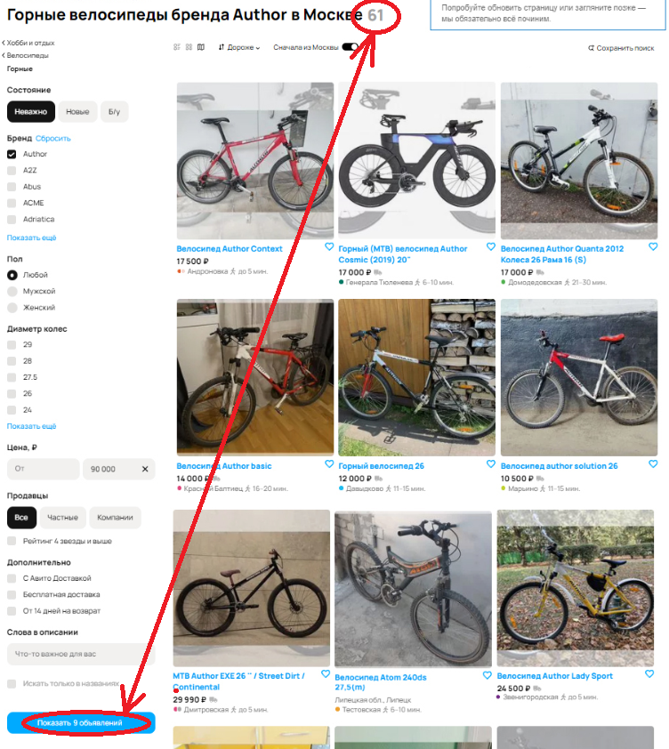

# Баги со скриншота по приоритетам

## I. High 

В данный раздел я определил серьезные ошибки, которые могут быть связаны с неправильной работой алгоритмов поиска товаров или добавления новых объявлений. Также здесь приведу одну ошибку, сигнализирующую об отказе работы одного из сервисов.

### 1. Количество объявлений 
Несоответствие количества найденных объявлений в заголовке страницы и в кнопке "Показать X объявлений" - после заголовка стоит число 61, а на кнопке написано: "Показать 9 объявлений". Это означает, что некоторые фильтры не применены. Поэтому сложно судить о корректности результата поиска. Это может быть обусловлено тем, что ранее был выполнен поиск, но затем были добавлены новые фильтры, после которого не была нажата кнопка "Показать 9 объявлений". Если же такой результат возник после нажатия на кнопку возможна ошибка поиска.

### 2. Пагинация
Из заголовка следует, что найдено 61 объявление, удовлетворяющее запросу. Внизу страницы присутствуют кнопки пагинации, позволяющие просмотреть 100 страниц с товарами, удовлетворяющими запросу. Однако, если на одной странице отображается 12 товаров, 100 страниц избыточно для такого числа объявлений. Ошибка может быть в том, что на самом деле найдено намного больше объявлений, или же объявлений действительно 61, тогда ошибка в отображении кнопок пагинации.

### 3. Несуществующий адрес
В карточке товара "Велосипед Atom 240ds 27,5(m)" содержится противоречивая информация. Указано, что товар находится в Липецке, однако станция метро Тестовская находится в Москве. Может оказаться, что при создании объявления пользователь может указать несуществующий адрес.

### 4. Сообщение об ошибке
В правом верхнем углу расположено окно с надписью об ошибке одной из функций. Это окно заметное и создает ущерб имиджу компании.

## II. Medium 

В данный раздел отнесу ошибки, вызванные неправильной работой алгоритмов сортировки товаров

### 1. Сортировка по цене
Сортировка товаров на странице выставлена таким образом, чтобы товары располагались в порядке убывания цены, однако после товара "Велосипед author solution 26" стоимостью 10500 рублей располагается товар "MTB Author EXE 26 ''/ Street Dirt / Continental" стоимостью 29990 рублей.

### 2. Неверный способ отображения объявлений
На странице выбран способ отображения информации "на карте", однако результаты поиска отображаются в виде галереи.

### 3. Навигационная цепочка
В навигационной цепочке (breadcrumbs) отображается не весь путь выбранных категорий. Ожидается следующая навигационная цепочка: "Главная > Хобби и отдых > Велосипеды > Горные".

### 4. Фильтр "Бренд"
Товар "Велосипед Atom 240ds 27,5(m)" не соответствует параметрам поиска - бренд, отличный от заданного.

### 5. Местонахождение товара
Станция метро Звенигородская находится на Фрунзенско-Приморской линии Петербургского метрополитена. Этот товар не должен был оказаться среди объявлений, так как запрашивались товары, продаваемые в Москве.

### 6. Время до метро
Неправильно рассчитано время до ближайшей станции метро в пешей доступности. Или же выбрана неправильная станция метро.

### 7. Цена товара
Не отображается цена товара.

## III. Low 

В этот раздел я определил опечатки и незначительные ошибки отображения элементов интерфейса.

### 1. Кнопка "Все категории"
Опечатка в кнопке "Все категории" - не хватает второй буквы "и".

### 2. Опечатка в карточке товара
В карточке товара "Велосипед Author Solution 21''" указана несуществующая станция метро "Ховин". Предполагаю, что это опечатка в названии станции "Ховрино".

### 3. Выравнивание объявлений по сетке 
Незначительные ошибки во внешнем виде страницы: карточка товара "Горный (МТВ) велосипед Author Cosmic (2019) 20''" находится чуть выше соседних карточек, карточка товара "Велосипед Atom 240ds 27,5(m)" находится чуть ниже соседних карточек.

